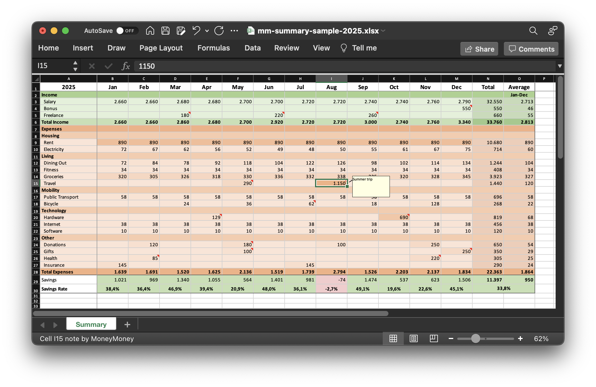

# MoneyMoney to Excel

Generate a compact yearly Excel summary from MoneyMoney transactions.

[MoneyMoney](https://moneymoney.app/) lets you tag transactions with your own categories and create rules to auto-categorize future ones.
`mm-summary` exports transactions [via AppleScript](https://moneymoney.app/applescript/), aggregates them by category, and builds an `.xlsx` workbook with monthly income, expenses, savings, savings rate, charts, and a subtle expense heatmap.

<!-- Generate this screenshot with `uv run mm_summary.py --sample-data --year 2025 --output docs/mm-summary-sample-2025.xlsx`, open the workbook in Excel, and capture the sheet to `docs/screenshot.png`. -->


The summary sheet is designed to answer a few practical questions quickly:

- How much came in and went out each month?
- How does spending break down by group and category?
- How much was saved each month?
- What was the savings rate?

## Requirements

- macOS
- [MoneyMoney](https://moneymoney-app.com/)
- Python 3.10+
- [`uv`](https://docs.astral.sh/uv/)

## Setup

Clone the repository and install dependencies with `uv`:

```bash
uv sync
```

Edit [`user_config.py`](./user_config.py) to match your MoneyMoney group names, ordering, and recurring categories.

## Usage

Open MoneyMoney, so that the script can access its database, then:
```bash
uv run mm_summary.py                  # current year
uv run mm_summary.py --year 2025      # specific year
uv run mm_summary.py --output ~/Desktop/summary.xlsx
```

To see all CLI options, use `--help`:

```text
usage: mm_summary.py [-h] [--year YEAR] [--account ACCOUNT]
                     [--category CATEGORY] [--output OUTPUT]
                     [--no-cell-comments] [--include-transactions-sheet]
                     [--sample-data] [--no-expense-heatmap]

Export MoneyMoney transactions and build an Excel summary for a specific year.

options:
  -h, --help            show this help message and exit
  --year YEAR           Year to export (default: current year)
  --account ACCOUNT     Optional MoneyMoney account name/identifier
  --category CATEGORY   Optional MoneyMoney category filter
  --output OUTPUT       Output .xlsx path
  --no-cell-comments    Do not add Excel comments
  --include-transactions-sheet
                        Include a Transactions sheet with raw export rows
  --sample-data         Generate a built-in sample workbook for docs or
                        screenshots
  --no-expense-heatmap  Disable the heatmap on expense month cells
```

## Project Structure

- [`mm_summary.py`](./mm_summary.py): CLI entrypoint
- [`moneymoney.py`](./moneymoney.py): AppleScript export, plist parsing
- [`aggregation.py`](./aggregation.py): yearly aggregation, note building
- [`excel_rendering.py`](./excel_rendering.py): workbook rendering, styling, charts
- [`models.py`](./models.py): shared dataclasses and type aliases
- [`sample_data.py`](./sample_data.py): deterministic sample transactions for demo workbooks
- [`user_config.py`](./user_config.py): your taxonomy, aliases, ordering

## Disclaimer

This project is provided as-is, without any warranty. It may contain bugs and may produce incomplete, misleading, or incorrect summaries.

Licensed under the Apache License 2.0. See `LICENSE`.
